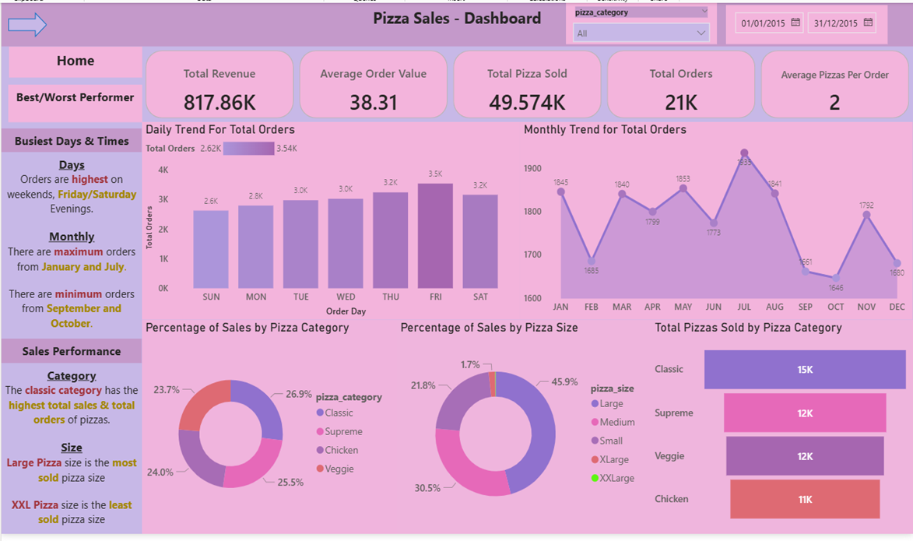
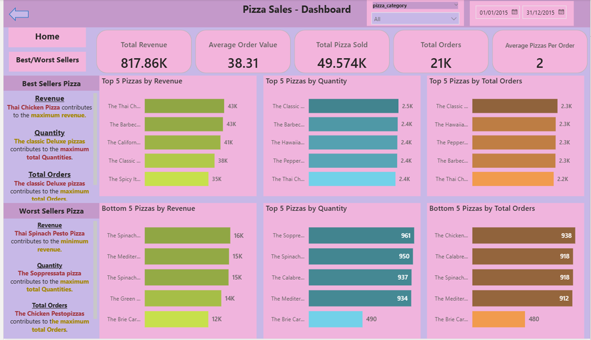

# SQL_PowerBI_Project__Pizza_Sales (Data Analysis Project)

### Problem Statement: 
You are a data analyst for a Pizza company that is looking to gain insights on the past year performance. Your task is to analyze the following metrics and create a Dashboard that clearly highlights the requirements below. Complete the project using SQL and Power BI.
#### Pizza Sales Dashboard

#### Best/Worst performers Dashboard 

### Database Setup
Created the database and loaded pizza_sales via SSMS import, then corrected data types post-import (order_time to TIME, quantity to INT) to ensure accurate aggregation.

### SQL Highlights
Used `GROUP BY` with a correlated subquery for percentage-of-total calculations (category/size breakdowns), `DATENAME()` for day-of-week and month extraction, and `TOP N ... ORDER BY` patterns for best/worst-seller rankings across revenue, quantity, and order count.

### Key DAX Measures
- Total Orders = DISTINCTCOUNT(pizza_sales[order_id])
- Total Revenue = SUM(pizza_sales[total_price])
- Total Pizza Sold = SUM(pizza_sales[quantity])
- Average Order Value = DIVIDE([Total Revenue], [Total Orders])
- Average Pizzas Per Order = DIVIDE([Total Pizza Sold], [Total Orders])
- Order Day = UPPER(LEFT(pizza_sales[Day Name], 3))
- Order Month = UPPER(LEFT(pizza_sales[Month Name], 3))
- Measures were organized in a dedicated Measures Table (separate from the data table) for cleaner model structure.

### Advanced Power BI Techniques Implemented
- Power Query transformations: replaced pizza size codes (S/M/L/XL/XXL → Small/Medium/Large/XLarge/XXLarge) at the query level, and built a conditional column to sequence Day Name for correct chart ordering
- Dedicated Measures Table pattern for DAX organization
  
### KPI Requirement
We will analyze key indicators for our pizza sales data to gain insights into our business performance. Specifically, we want to calculate the following metrics:

| Metric | Description |
|---|---|
| Total Revenue | The sum of the total price of all pizza orders. |
| Average Order Value | The average amount spent per order, calculated by dividing the total revenue by the total number of orders. |
| Total Pizzas Sold | The sum of the quantities of all pizzas sold. |
| Total Orders | The total number of orders placed. |
| Average Pizzas Per Order | The average number of pizzas sold per order, calculated by dividing the total number of pizzas sold by the total number of orders. |

### Charts Requirement

We would like to visualize various aspects of out pizza sales data to gain insights and understand key trends. We have identified the following requirements for creating charts:

| Task | Description |
|---|---|
| Daily Trend for Total Orders | Create a bar chart that displays the daily trend of total orders over a specific time period. This chart will help us identify any patterns or fluctuations in the order volumes on a daily basis. |
| Monthly Trend for Total Orders | Create a line chart that illustrates the hourly trend of total orders throughout the day. This chart will allow us to identify peak hours or periods of high order activity. |
| Percentage of Sales by Pizza Category | Create a pie chart that shows the distribution of sales across different pizza categories. This chart will provide insights into the popularity of various pizza categories and their contribution to overall sales. |
| Percentage of Sales by Pizza Size | Generate a pie chart that represents the percentage of sales attributed to different pizza sizes. This chart will help us understand customer preferences for pizza sizes and their impact on sales. |
| Total Pizzas Sold by Pizza Category | Create a funnel chart that presents the total number of pizzas sold for each pizza category. This chart will allow us to compare the sales performance of different pizza categories. |
| Top 5 Best Sellers by Revenue, Total Quantity, and Total Orders | Create a bar chart highlighting the top 5 best-selling pizzas based on the Revenue, Total Quantity, Total Orders. This chart will help us identify the most popular pizza options. |
| Bottom 5 Sellers by Revenue, Total Quantity, and Total Orders | Create a bar chart showcasing the bottom 5 worst selling pizzas based on the Revenue, Total Quantity, and Total Orders. This chart will enable us to identify underperforming or less popular pizza options. |
| Top 5 pizza by quantity | Create a bar chart showcasing Top 5 pizza by quantity. |
| Bottom 5 pizza by quantity | Create a bar chart showcasing bottom 5 pizza by quantity. |
| Top 5 pizza by total order | Create a bar chart showcasing Top 5 pizza by total order. |
| Bottom 5 pizza by total order | Create a bar chart showcasing bottom 5 pizza by total order. |

### Key Findings
- Total revenue: **$817,860.05** across **21,350 orders** and **49,574 pizzas sold** (avg. **2 pizzas/order**, avg. order value **$38.31**)
- **Classic pizzas led in both revenue and volume** — 26.91% of total revenue ($220,053) and 14,888 units sold, ahead of Supreme (25.46%, 11,987 units)
- **Large is the dominant size**, driving 45.9% of all revenue ($375,319), while **XXL contributes just 0.12%** ($1,007) — a strong signal XXL may not be worth maintaining as a menu option
- **Friday and Saturday are the busiest days** (3,538 and 3,158 orders), while **Sunday is the slowest weekday** (2,624) despite being a weekend day — breaking the usual "weekend = peak" assumption
- **The Classic Deluxe Pizza is the strongest single performer** — #1 in both quantity sold (2,453) and total orders (2,329)
- **The Brie Carre Pizza is a clear underperformer** across every metric — lowest revenue ($11,588), lowest quantity (490), and lowest order count (480), less than a quarter of the top seller's volume

### Recommendation
Focus promotional inventory and prep planning on Large-size Classic and Barbecue Chicken/Thai Chicken variants, which dominate both revenue and volume. Consider phasing out or repricing XXL, which contributes negligible revenue (0.12%) relative to shelf/prep complexity, and re-evaluate the Brie Carre Pizza's place on the menu given its consistent bottom-ranking across all three performance metrics. Staffing should be weighted toward Friday/Saturday evenings, with Sunday treated closer to a weekday than a peak day
